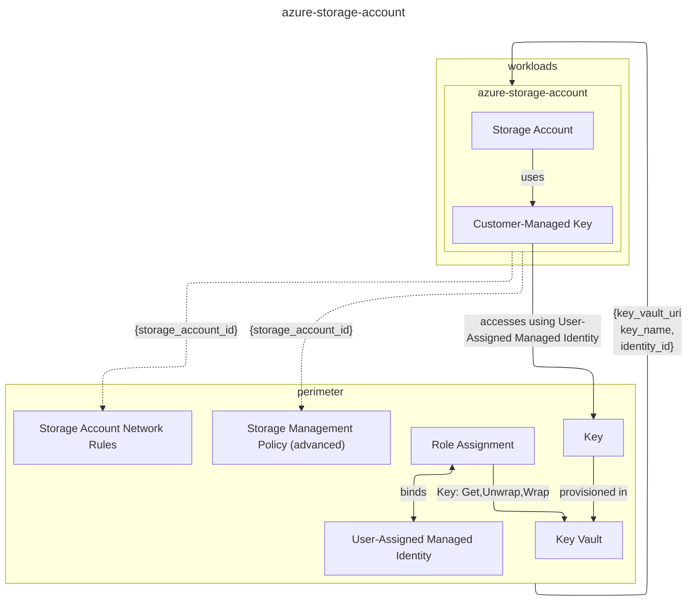

# Azure Storage Account

<!-- https://mermaid.live/ -->


You can learn in the [Design principles](../../DESIGN.md) about the `perimeter` and `workloads` as well as other design principles.

## Pre-requisites
- To deploy this module, you have at least the following permissions:
    + Reader of the subscription
    + Access to the [Key Vault where the Customer-Managed Key is stored](https://registry.terraform.io/providers/hashicorp/azurerm/latest/docs/resources/storage_account_customer_managed_key#key_vault_id-1) in case one is used
    + Contributor of the resource group
- Read [Blob Storage feature support in Azure Storage accounts](https://learn.microsoft.com/en-us/azure/storage/blobs/storage-feature-support-in-storage-accounts) to understand which combinations of values make sense and are supported

## Use Cases Unique AI

You can find basic examples in the [examples](./examples) folder. As this module is mostly used to deploy Unique AI, some specific configurations might be required per use case. Unique on purpose does not offer a selected module per use case as of today as keeping 4 modules (or 4 wrapper modules) updated is more error-prone and a configuration and management hell.

### Unique AI Ingestion Storage

The most relevant use case and straight forward. You can use the [`secure_by_default`](./examples/secure_by_default/main.tf) variant to start.

### Unique AI Ingestion Cache Store

The cache stores files temporarily until shortly after they are ingested. You can use the [`secure_by_default`](./examples/secure_by_default/main.tf) variant to start but then adjust the `storage_management_policy_default` to your `cache` time preferences, namely the `blob_to_deleted_after_last_modified_days`.

### Audit Log Storage

Clients wishing to store Unique Audit Logs can refer to the [`audit_logs`](./examples/audit_logs/main.tf) example. The key difference is the `is_nfs_mountable` flag and the specific storage time of 5 years (change that to whatever your compliance policies dictate).

> [!WARNING]
> Audit Logs can grow quite quickly, so will the costs. You might want to adjust the `account_replication_type` and adjust the `storage_management_policy_default` `*archive*` properties to move audit logs into an `archived` state reducing the costs.

### Observability Artefacts

As of today mostly used internally at Unique AI, this [`example`](./examples/observability_logs/main.tf) acts as storage for [Loki and Tempo](https://grafana.com/go/webinar/getting-started-with-grafana-lgtm-stack/). These workloads support workload identity access and thus the configuration differs from our normal config <!-- Unique internal fix ref to support identities as well: UN-14227 -->.

## Backups

This module supports creating an Azure Data Protection Backup Vault for the storage account. To enable backups, provide the `backup_vault` variable with your desired configuration.

> [!NOTE]
> When using the module multiple times, each instance will automatically create a backup vault with a unique name by appending a random suffix to the base name. This ensures no naming conflicts occur between different module instances.

## Networking

True to the [Design principles](../../DESIGN.md), Network limitations should not be done inside the module. That is why the module does not contain any networking limitations. The consumer should apply the network limitations in the `perimeter` layer, e.g. by using [`azurerm_storage_account_network_rules`](https://registry.terraform.io/providers/hashicorp/azurerm/3.117.0/docs/resources/storage_account_network_rules). The `storage_account_id` can be used to apply the network limitations.

⚠️ When using `is_nfs_mountable` then a `network_rules` variable is required as Azure does not allow the creation of such accounts without `Deny`ing traffic from creation.

# Module

<!-- BEGIN_TF_DOCS -->
## Requirements

| Name | Version |
|------|---------|
| <a name="requirement_terraform"></a> [terraform](#requirement\_terraform) | >= 1.5 |
| <a name="requirement_azurerm"></a> [azurerm](#requirement\_azurerm) | ~> 4.15 |
| <a name="requirement_random"></a> [random](#requirement\_random) | ~> 3 |

## Providers

| Name | Version |
|------|---------|
| <a name="provider_azurerm"></a> [azurerm](#provider\_azurerm) | ~> 4.15 |
| <a name="provider_random"></a> [random](#provider\_random) | ~> 3 |

## Modules

No modules.

## Resources

| Name | Type |
|------|------|
| [azurerm_data_protection_backup_instance_blob_storage.backup_instance](https://registry.terraform.io/providers/hashicorp/azurerm/latest/docs/resources/data_protection_backup_instance_blob_storage) | resource |
| [azurerm_data_protection_backup_policy_blob_storage.backup_policy](https://registry.terraform.io/providers/hashicorp/azurerm/latest/docs/resources/data_protection_backup_policy_blob_storage) | resource |
| [azurerm_data_protection_backup_vault.backup_vault](https://registry.terraform.io/providers/hashicorp/azurerm/latest/docs/resources/data_protection_backup_vault) | resource |
| [azurerm_key_vault_key.storage-account-byok](https://registry.terraform.io/providers/hashicorp/azurerm/latest/docs/resources/key_vault_key) | resource |
| [azurerm_key_vault_secret.storage-account-connection-string-1](https://registry.terraform.io/providers/hashicorp/azurerm/latest/docs/resources/key_vault_secret) | resource |
| [azurerm_key_vault_secret.storage-account-connection-string-2](https://registry.terraform.io/providers/hashicorp/azurerm/latest/docs/resources/key_vault_secret) | resource |
| [azurerm_private_endpoint.storage_account_pe](https://registry.terraform.io/providers/hashicorp/azurerm/latest/docs/resources/private_endpoint) | resource |
| [azurerm_role_assignment.backup_vault_storage_access](https://registry.terraform.io/providers/hashicorp/azurerm/latest/docs/resources/role_assignment) | resource |
| [azurerm_storage_account.storage_account](https://registry.terraform.io/providers/hashicorp/azurerm/latest/docs/resources/storage_account) | resource |
| [azurerm_storage_account_customer_managed_key.cmk](https://registry.terraform.io/providers/hashicorp/azurerm/latest/docs/resources/storage_account_customer_managed_key) | resource |
| [azurerm_storage_account_customer_managed_key.storage_account_cmk](https://registry.terraform.io/providers/hashicorp/azurerm/latest/docs/resources/storage_account_customer_managed_key) | resource |
| [azurerm_storage_container.container](https://registry.terraform.io/providers/hashicorp/azurerm/latest/docs/resources/storage_container) | resource |
| [azurerm_storage_management_policy.default](https://registry.terraform.io/providers/hashicorp/azurerm/latest/docs/resources/storage_management_policy) | resource |
| [random_string.suffix](https://registry.terraform.io/providers/hashicorp/random/latest/docs/resources/string) | resource |

## Inputs

| Name | Description | Type | Default | Required |
|------|-------------|------|---------|:--------:|
| <a name="input_access_tier"></a> [access\_tier](#input\_access\_tier) | Type of replication to use for this storage account. Learn more about storage account access tiers in the Azure Docs. Defaults to Cool as the difference is negligible for most use cases but is more cost-efficient. | `string` | `"Cool"` | no |
| <a name="input_account_kind"></a> [account\_kind](#input\_account\_kind) | Kind to use for the storage account. Learn more about storage account kinds in the Azure Docs. | `string` | `"StorageV2"` | no |
| <a name="input_account_replication_type"></a> [account\_replication\_type](#input\_account\_replication\_type) | Type of replication to use for this storage account. Learn more about storage account replication types in the Azure Docs. | `string` | `"ZRS"` | no |
| <a name="input_account_tier"></a> [account\_tier](#input\_account\_tier) | Tier to use for the storage account. Learn more about storage account tiers in the Azure Docs. | `string` | `"Standard"` | no |
| <a name="input_backup_instance"></a> [backup\_instance](#input\_backup\_instance) | Configuration for the backup instance when backup\_vault is enabled. | <pre>object({<br/>    name                            = optional(string, "default-blob-backup-instance")<br/>    storage_account_container_names = optional(list(string))<br/>    tags                            = optional(map(string), {})<br/>  })</pre> | <pre>{<br/>  "name": "default-blob-backup-instance",<br/>  "tags": {}<br/>}</pre> | no |
| <a name="input_backup_policy"></a> [backup\_policy](#input\_backup\_policy) | Configuration for the backup policy when backup\_vault is enabled. | <pre>object({<br/>    name                                   = optional(string, "default-blob-backup-policy")<br/>    operational_default_retention_duration = optional(string, "P2W")<br/>    vault_default_retention_duration       = optional(string)<br/>    backup_repeating_time_intervals        = optional(list(string), null)<br/>    time_zone                              = optional(string)<br/>    retention_rules = optional(list(object({<br/>      name     = string<br/>      priority = number<br/>      criteria = object({<br/>        absolute_criteria      = optional(string)<br/>        days_of_month          = optional(list(number))<br/>        days_of_week           = optional(list(string))<br/>        months_of_year         = optional(list(string))<br/>        scheduled_backup_times = optional(list(string))<br/>        weeks_of_month         = optional(list(string))<br/>      })<br/>      life_cycle = object({<br/>        data_store_type = optional(string, "VaultStore")<br/>        duration        = string<br/>      })<br/>    })), [])<br/>    tags = optional(map(string), {})<br/>  })</pre> | `{}` | no |
| <a name="input_backup_role_assignment_enabled"></a> [backup\_role\_assignment\_enabled](#input\_backup\_role\_assignment\_enabled) | Whether to create the role assignment for the backup vault to access the storage account. Set to false if you don't have permissions to create role assignments. | `bool` | `true` | no |
| <a name="input_backup_vault"></a> [backup\_vault](#input\_backup\_vault) | Configuration for Azure Data Protection Backup Vault. If provided, creates a backup vault and configures backup for the storage account. | <pre>object({<br/>    name                         = optional(string, "storage-backup-vault")<br/>    location                     = optional(string)<br/>    resource_group_name          = optional(string)<br/>    datastore_type               = optional(string, "VaultStore")<br/>    redundancy                   = optional(string, "ZoneRedundant")<br/>    cross_region_restore_enabled = optional(bool, false)<br/>    identity = optional(object({<br/>      type = string<br/>    }), { type = "SystemAssigned" })<br/>    retention_duration_in_days = optional(number, 14)<br/>    immutability               = optional(string, "Disabled")<br/>    soft_delete                = optional(string, "On")<br/>    tags                       = optional(map(string), {})<br/>    random_suffix_enabled      = optional(bool, true)<br/>  })</pre> | <pre>{<br/>  "name": "storage-backup-vault"<br/>}</pre> | no |
| <a name="input_connection_settings"></a> [connection\_settings](#input\_connection\_settings) | Object containing the connection strings and the Key Vault secret ID where the connection strings will be stored | <pre>object({<br/>    connection_string_1 = string<br/>    connection_string_2 = string<br/>    key_vault_id        = string<br/>    expiration_date     = optional(string, "2099-12-31T23:59:59Z")<br/>  })</pre> | `null` | no |
| <a name="input_containers"></a> [containers](#input\_containers) | Map of containers to create in the storage account where the key is the name. | <pre>map(object({<br/>    access_type = optional(string, "private")<br/>  }))</pre> | `{}` | no |
| <a name="input_cors_rules"></a> [cors\_rules](#input\_cors\_rules) | CORS rules for the storage account | <pre>list(object({<br/>    allowed_origins    = list(string)<br/>    allowed_methods    = list(string)<br/>    allowed_headers    = list(string)<br/>    exposed_headers    = list(string)<br/>    max_age_in_seconds = number<br/>  }))</pre> | `[]` | no |
| <a name="input_customer_managed_key"></a> [customer\_managed\_key](#input\_customer\_managed\_key) | Customer managed key properties for the storage account. Refer to the readme for more information on what is needed to enable customer-managed key encryption. It is recommended to not use key\_version unless you have a specific reason to do so as leaving it out will allow automatic key rotation. The key\_vault\_id must be accessible to the user\_assigned\_identity\_id. | <pre>object({<br/>    key_name                  = string<br/>    key_vault_id              = string<br/>    key_version               = optional(string, null)<br/>    user_assigned_identity_id = string<br/>  })</pre> | `null` | no |
| <a name="input_data_protection_settings"></a> [data\_protection\_settings](#input\_data\_protection\_settings) | Settings for data protection features including soft delete, versioning, change feed and point-in-time restore. | <pre>object({<br/>    blob_soft_delete_retention_days      = optional(number, 30) # 1-365 days<br/>    change_feed_retention_days           = optional(number, 7)  # 0-146000 days<br/>    container_soft_delete_retention_days = optional(number, 30) # 1-365 days<br/>    point_in_time_restore_days           = optional(number, 7)<br/>    versioning_enabled                   = optional(bool, true)<br/>  })</pre> | <pre>{<br/>  "blob_soft_delete_retention_days": 30,<br/>  "change_feed_retention_days": 7,<br/>  "container_soft_delete_retention_days": 30,<br/>  "point_in_time_restore_days": 7,<br/>  "versioning_enabled": true<br/>}</pre> | no |
| <a name="input_identity_ids"></a> [identity\_ids](#input\_identity\_ids) | List of managed identity IDs to assign to the storage account. | `list(string)` | `[]` | no |
| <a name="input_infrastructure_encryption_enabled"></a> [infrastructure\_encryption\_enabled](#input\_infrastructure\_encryption\_enabled) | Enable infrastructure encryption for the storage account. | `bool` | `false` | no |
| <a name="input_is_nfs_mountable"></a> [is\_nfs\_mountable](#input\_is\_nfs\_mountable) | Enable NFSv3 and HNS protocol for the storage account in order to be mounted to AKS/nodes. In order to enable this, the account\_tier and the account\_kind must be set to a limited subset, refer to the Azure Docs(https://registry.terraform.io/providers/hashicorp/azurerm/latest/docs/resources/storage_account#is_hns_enabled-1) for more information. | `bool` | `false` | no |
| <a name="input_location"></a> [location](#input\_location) | Location of the resources. | `string` | n/a | yes |
| <a name="input_min_tls_version"></a> [min\_tls\_version](#input\_min\_tls\_version) | Minimum TLS version supported by the storage account. | `string` | `"TLS1_2"` | no |
| <a name="input_name"></a> [name](#input\_name) | Name of the storage account. | `string` | n/a | yes |
| <a name="input_network_rules"></a> [network\_rules](#input\_network\_rules) | Generally network rules should be managed outside this module, but when using `is_nfs_mountable` then a `network_rules` variable is required as Azure does not allow the creation of such accounts without `Deny`ing traffic from creation. | <pre>object({<br/>    virtual_network_subnet_ids = list(string)<br/>    ip_rules                   = list(string)<br/>    bypass                     = optional(list(string), ["Metrics", "Logging", "AzureServices"])<br/>    private_link_accesses = list(object({<br/>      endpoint_resource_id = string<br/>      endpoint_tenant_id   = string<br/>    }))<br/>  })</pre> | `null` | no |
| <a name="input_private_endpoint"></a> [private\_endpoint](#input\_private\_endpoint) | Configuration for private endpoint | <pre>object({<br/>    subnet_id           = string<br/>    private_dns_zone_id = string<br/>    location            = optional(string)<br/>    subresource_names   = optional(list(string), ["blob"])<br/>    tags                = optional(map(string), {})<br/>  })</pre> | `null` | no |
| <a name="input_public_network_access_enabled"></a> [public\_network\_access\_enabled](#input\_public\_network\_access\_enabled) | Enable public network access for the storage account. | `bool` | `false` | no |
| <a name="input_resource_group_name"></a> [resource\_group\_name](#input\_resource\_group\_name) | Name of the resource group to put the resources in. | `string` | n/a | yes |
| <a name="input_self_cmk"></a> [self\_cmk](#input\_self\_cmk) | Details for the self customer managed key. | <pre>object({<br/>    key_name                  = string<br/>    key_vault_id              = string<br/>    key_type                  = optional(string, "RSA-HSM")<br/>    key_size                  = optional(number, 2048)<br/>    key_opts                  = optional(list(string), ["decrypt", "encrypt", "sign", "unwrapKey", "verify", "wrapKey"])<br/>    user_assigned_identity_id = string<br/><br/>  })</pre> | `null` | no |
| <a name="input_shared_access_key_enabled"></a> [shared\_access\_key\_enabled](#input\_shared\_access\_key\_enabled) | Enable shared access key for the storage account. Note that when disabled, terraform must be configured to use Azure Entra Authentication for the storage (https://registry.terraform.io/providers/hashicorp/azurerm/latest/docs/resources/storage_account.html#shared_access_key_enabled-1). | `bool` | `true` | no |
| <a name="input_storage_account_tags"></a> [storage\_account\_tags](#input\_storage\_account\_tags) | Additional tags that apply only to the main storage account. These will be merged with the general tags variable. | `map(string)` | `{}` | no |
| <a name="input_storage_management_policy_default"></a> [storage\_management\_policy\_default](#input\_storage\_management\_policy\_default) | A simple abstraction of the most common properties for storage management lifecycle policies. If the simple implementation does not meet your needs, please open an issue. If you use this module to safe files that are rarely to never accessed again, opt for a very aggressive policy (starting already cool and archiving early). If you want to implement your own storage management policy, disable the default and use the output storage\_account\_id to implement your own policies. Note: Archive tier is only supported for LRS, GRS, and RA-GRS replication types. It is NOT supported for ZRS, GZRS, or RA-GZRS. The module will automatically skip archive tier for unsupported replication types. | <pre>object({<br/>    blob_to_cool_after_last_modified_days    = optional(number, 10)<br/>    blob_to_cold_after_last_modified_days    = optional(number, 50)<br/>    blob_to_archive_after_last_modified_days = optional(number, null)<br/>    blob_to_deleted_after_last_modified_days = optional(number, null)<br/>  })</pre> | <pre>{<br/>  "blob_to_archive_after_last_modified_days": null,<br/>  "blob_to_cold_after_last_modified_days": 50,<br/>  "blob_to_cool_after_last_modified_days": 10,<br/>  "blob_to_deleted_after_last_modified_days": null<br/>}</pre> | no |
| <a name="input_tags"></a> [tags](#input\_tags) | Tags for the resources. | `map(string)` | `{}` | no |

## Outputs

| Name | Description |
|------|-------------|
| <a name="output_backup_instance_id"></a> [backup\_instance\_id](#output\_backup\_instance\_id) | The ID of the backup instance |
| <a name="output_backup_policy_id"></a> [backup\_policy\_id](#output\_backup\_policy\_id) | The ID of the backup policy |
| <a name="output_backup_vault_id"></a> [backup\_vault\_id](#output\_backup\_vault\_id) | The ID of the backup vault |
| <a name="output_backup_vault_identity_principal_id"></a> [backup\_vault\_identity\_principal\_id](#output\_backup\_vault\_identity\_principal\_id) | The principal ID of the backup vault's managed identity. Use this to manually assign the 'Storage Account Backup Contributor' role when enable\_backup\_role\_assignment is false. |
| <a name="output_backup_vault_name"></a> [backup\_vault\_name](#output\_backup\_vault\_name) | The name of the backup vault |
| <a name="output_storage_account_connection_strings"></a> [storage\_account\_connection\_strings](#output\_storage\_account\_connection\_strings) | Connection strings for the storage account, provided for backward compatibility reasons. It is recommended to use Workload or Managed Identity authentication wherever possible |
| <a name="output_storage_account_id"></a> [storage\_account\_id](#output\_storage\_account\_id) | The ID of the storage account |
| <a name="output_storage_account_name"></a> [storage\_account\_name](#output\_storage\_account\_name) | The name of the storage account. Recommended only to be used for data sourcing as the Azure RM provider recommends using the ID instead for managing state. |
<!-- END_TF_DOCS -->

## Limitations

- This module as of now is not supporting [`azurerm_key_vault_managed_hardware_security_module` (HSM-backend Key Vaults)](https://registry.terraform.io/providers/hashicorp/azurerm/3.117.0/docs/resources/key_vault_managed_hardware_security_module).
- Neither change feed nor versioning are currently supported by this module. If you need these features, please open an issue. They are omitted for brevity and simplicity not because we do not want to support them.
- Future versions will ship with built-in [`azurerm_storage_container_immutability_policy`](https://registry.terraform.io/providers/hashicorp/azurerm/3.117.0/docs/resources/storage_container_immutability_policy).

## Archive Tier Support

The Archive access tier is **only supported** for the following replication types:
- **LRS** (Locally Redundant Storage)
- **GRS** (Geo-Redundant Storage)
- **RA-GRS** (Read-Access Geo-Redundant Storage)

The Archive tier is **NOT supported** for:
- **ZRS** (Zone-Redundant Storage) - Default in this module
- **GZRS** (Geo-Zone-Redundant Storage)
- **RA-GZRS** (Read-Access Geo-Zone-Redundant Storage)

**Why?** Archive tier storage is designed for cold data with longer retrieval times and doesn't require synchronous zone or regional redundancy. ZRS and related types replicate data synchronously across availability zones, which conflicts with how the Archive tier works.

**The module automatically handles this** by skipping the `tier_to_archive_after_days_since_modification_greater_than` setting when using unsupported replication types. If you need Archive tier support, change the `account_replication_type` to `LRS`, `GRS`, or `RA-GRS`.

**Compatibility with Unique AI:** Unique AI can currently not handle archived content/files/blobs gracefully, see [Use Cases Unique AI](#use-cases-unique-ai) for more information.

## Compatibility

| Module Version | Compatibility |
|---|---|
| `> 2.1.0` | `unique.ai`: `~> 2025.16` |

## Upgrading

### ~> `4.0.0`

Only users that have set `backup_vault.name` explictily are affected by this upgrade as the module now appends a random suffix to the backup vault by default. This behaviour can be modified by setting `backup_vault.random_suffix_enabled` respectively.

Users that have given a name to the backup vault before `4.0.0` will need to set `backup_vault.random_suffix_enabled = false` to avoid breaking changes.

### ~> `3.0.0`

> [!CAUTION]
> This upgrade is heavily breaking and users have two options outlined below.
> ```
>   ~ account_replication_type           = "LRS" -> "ZRS" # forces replacement
> ```

#### Manually perform the change of `account_replication_type` mostly
The new defaults in `3.0.0` make the account more resilient by default. Changing these properties via Terraform though leads to recreation. To circumvent that you can:

1. Upgrade in code
1. Run `terraform plan` and inspect diff
1. Perform changes on the account manually in the portal with the matching permissions
1. Repeat plan and inspection until no major diff or recreation remains
1. Apply and be in sync

> [!IMPORTANT]
> You are the owner of your infrastructure and liable for your data. Unique waives liability for wrongly executed upgrades that result in damage or data loss.

#### Upgrade variables to reflect current state

Manually adjust the `account_replication_type` to your previous value.

#### Other changes
Some minor variable changes must be performed, including.

- `deleted_retain_days` got moved to `data_protection_settings.blob_soft_delete_retention_days`
- `container_deleted_retain_days` got moved to `data_protection_settings.container_soft_delete_retention_days`