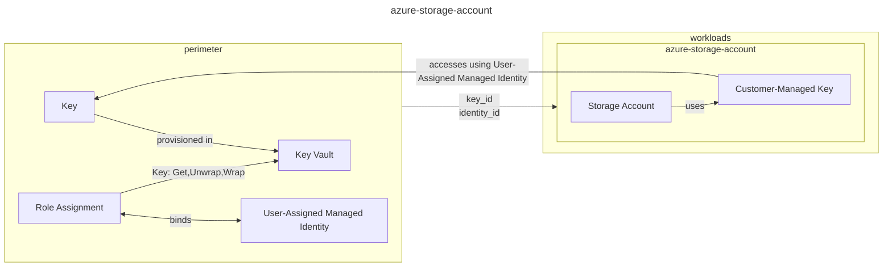

# Azure Storage Account

<!-- https://mermaid.live/ -->

You can learn in the [Design principles](../../DESIGN.md) about the `perimeter` and `workloads` as well as other design principles.

## Backups
> [!IMPORTANT]
> A module holding a `azurerm_data_protection_backup_vault` will be provided in an upcoming release.

This module does not and will not abstract a Backup Vault because the backup vault highly depends on the Storage Account itself introducing a chicken-egg/_apply first_ problem.

The base for this decision is laid out in [Design principles](../../DESIGN.md) as well.

# Module

<!-- BEGIN_TF_DOCS -->
## Requirements

| Name | Version |
|------|---------|
|  [terraform](#requirement\_terraform) | >= 1.5 |
|  [azurerm](#requirement\_azurerm) | >= 3.117 |

## Providers

| Name | Version |
|------|---------|
|  [azurerm](#provider\_azurerm) | >= 3.117 |

## Modules

No modules.

## Resources

| Name | Type |
|------|------|
| [azurerm_storage_account.storage_account](https://registry.terraform.io/providers/hashicorp/azurerm/latest/docs/resources/storage_account) | resource |
| [azurerm_storage_account_customer_managed_key.cmk](https://registry.terraform.io/providers/hashicorp/azurerm/latest/docs/resources/storage_account_customer_managed_key) | resource |

## Inputs

| Name | Description | Type | Default | Required |
|------|-------------|------|---------|:--------:|
|  [access\_tier](#input\_access\_tier) | Type of replication to use for this storage account. Learn more about storage account access tiers in the Azure Docs. | `string` | `"Cool"` | no |
|  [account\_kind](#input\_account\_kind) | Kind to use for the storage account. Learn more about storage account kinds in the Azure Docs. | `string` | `"StorageV2"` | no |
|  [account\_replication\_type](#input\_account\_replication\_type) | Type of replication to use for this storage account. Learn more about storage account replication types in the Azure Docs. | `string` | `"ZRS"` | no |
|  [account\_tier](#input\_account\_tier) | Tier to use for the storage account. Learn more about storage account tiers in the Azure Docs. | `string` | `"Standard"` | no |
|  [cors\_rules](#input\_cors\_rules) | CORS rules for the storage account | <pre>list(object({     allowed_origins    = list(string)     allowed_methods    = list(string)     allowed_headers    = list(string)     exposed_headers    = list(string)     max_age_in_seconds = number   }))</pre> | `[]` | no |
|  [customer\_managed\_key](#input\_customer\_managed\_key) | Customer managed key properties for the storage account. Refer to the readme for more information on what is needed to enable customer-managed key encryption. It is recommended to not use key\_version unless you have a specific reason to do so as leaving it out will allow automatic key rotation. | <pre>object({     key_vault_uri = string     key_name      = string     key_version   = optional(string, null)   })</pre> | `null` | no |
|  [identity\_ids](#input\_identity\_ids) | List of managed identity IDs to assign to the storage account. | `list(string)` | `[]` | no |
|  [is\_nfs\_mountable](#input\_is\_nfs\_mountable) | Enable NFSv3 and HNS protocol for the storage account in order to be mounted to AKS/nodes. | `bool` | `false` | no |
|  [location](#input\_location) | Location of the resources. | `string` | n/a | yes |
|  [min\_tls\_version](#input\_min\_tls\_version) | Minimum TLS version supported by the storage account. | `string` | `"TLS1_2"` | no |
|  [name](#input\_name) | Name of the storage account. | `string` | n/a | yes |
|  [resource\_group\_name](#input\_resource\_group\_name) | Name of the resource group to put the resources in. | `string` | n/a | yes |
|  [tags](#input\_tags) | Tags for the resources. | `map(string)` | `{}` | no |

## Outputs

| Name | Description |
|------|-------------|
|  [storage\_account\_connection\_strings](#output\_storage\_account\_connection\_strings) | Connection strings for the storage account, provided for backward compatibility reasons. It is recommended to use Workload or Managed Identity authentication wherever possible. |
<!-- END_TF_DOCS -->

## Limitations

- This module as of now is not supporting [`azurerm_key_vault_managed_hardware_security_module` (HSM-backend Key Vaults)](https://registry.terraform.io/providers/hashicorp/azurerm/latest/docs/resources/key_vault_managed_hardware_security_module).
